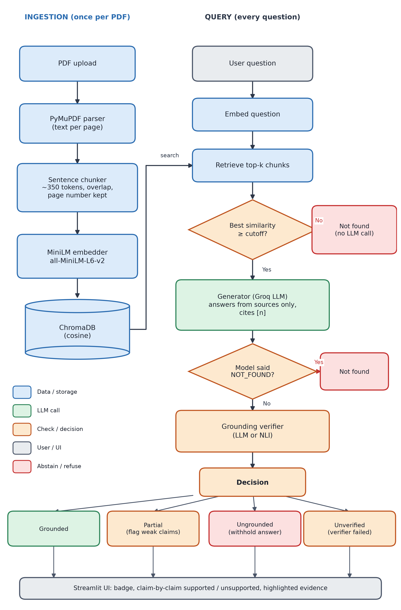

# 🛡️ VeriDoc

**A PDF chatbot that tells you when it isn't sure.**
Standard RAG (chunk → embed → retrieve → generate), plus a **grounding layer**: before an answer is
shown, every claim in it is checked against the retrieved text. Claims the document does not back are
flagged, and if nothing can be verified VeriDoc says *"Not found in the document"* instead of guessing.

**Live app:** see `docs/links.json` / the report (free hosting may sleep; the first load can take a minute).



## How it works

```
PDF ─► PyMuPDF ─► sentence-aware chunks (~350 tok, overlap, exact page) ─► MiniLM embeddings ─► ChromaDB
                                                                                                   │
question ─► embed ─► top-k chunks ──► similarity below cutoff? ──yes──► "Not found" (no LLM call)  │
                         │ no                                                                      │
                         ▼                                                                         │
              LLM answers from ONLY those chunks, citing [n]  ── says NOT_FOUND? ──► "Not found"   │
                         │                                                                         │
                         ▼                                                                         │
              GROUNDING CHECK (per claim)                                                          │
                ├─ LLM verifier: decompose into claims, each needs a verbatim quote,               │
                │                quote is then string-matched against the cited chunk              │
                └─ NLI verifier: local entailment model (DeBERTa) scores chunk-window ⊨ claim      │
                         ▼
   all claims supported ► ✅ Grounded    some ► ⚠️ Partial (weak claims flagged)
   none supported ► ⛔ Not grounded (answer withheld, draft kept behind an expander)
   verifier crashed / bad JSON ► "unverified" warning (fails closed, never shown as grounded)
```

The UI shows a coloured grounding badge, a ✅/❌ line per claim with the supporting page, and the
retrieved chunks with the supporting quote highlighted.

### Design decisions worth knowing
* **The verifier can't just say "yes".** In LLM mode a claim only counts as supported if the verifier
  supplies a source number *and* a quote that is actually found in that chunk. An invented quote demotes the
  claim to unsupported (`tests/test_veridoc.py::test_verifier_cannot_assert_support_without_a_real_quote`).
* **Fail closed.** If the verifier errors, the answer is labelled *unverified*, never *grounded*.
* **Cheap abstention.** Off-topic questions are caught by a similarity cutoff before any LLM call.
* **Chunks never span pages**, so every citation has an exact page number.
* **Baseline mode** (grounding off) is built in, so you can demo the same question with and without the check.

## Run it

```bash
pip install -r requirements.txt
cp .env.example .env          # add your free Groq key from console.groq.com
# default model: openai/gpt-oss-120b (llama-3.3-70b-versatile was retired by Groq);
# override with VERIDOC_LLM_MODEL. If a model's daily token cap is hit, the client falls back to VERIDOC_FALLBACK_MODELS.
streamlit run app.py
```
Click **Load sample handbook** in the sidebar (a fictional company handbook, all facts invented) or upload your own PDF.

### Try this demo script
| Ask | Expected |
|---|---|
| How many days of annual leave do employees get? | ✅ Grounded, page 1 |
| What is the daily meal reimbursement limit for domestic travel? | ✅ Grounded, page 3 |
| What is the bereavement leave policy? | Not found in the document |
| How many stock options do new hires receive? | Not found in the document |
| Who is the CEO of Northwind Robotics? | Not found in the document |
| What is the capital of France? | Not found (off-topic cutoff, zero LLM calls) |

Then switch the sidebar to **Off (baseline RAG)** (optionally tick *Typical chatbot prompt*) and ask the unanswerable ones again to compare with an unchecked RAG. With the generator used here, the baseline also refused; the difference is that its answer is unverified and shows no claim-level evidence.

## Evaluation (mini ablation)

`eval/questions.json` holds 12 answerable and 10 unanswerable questions (8 plausible-but-absent, 2 off-topic)
over the sample handbook. `eval/run_eval.py` runs them through **baseline RAG**, the **LLM verifier** and the
**NLI verifier** and reports:

* **Answer rate** – answerable questions answered correctly
* **Hallucination rate** – unanswerable questions where an answer was shown anyway (lower is better)
* **Abstain rate** – its complement
* **Grounded precision** – of answers badged fully *grounded*, how many are correct

```bash
python eval/run_eval.py                                                        # development set
python eval/run_eval.py --questions eval/questions_heldout.json --tag _heldout # held-out set
python eval/run_eval.py --configs naive naive_llm --tag _naive                 # typical-prompt experiment
```

Real results (generator `openai/gpt-oss-120b`, temperature 0, no thresholds tuned). Raw per-question rows are in `eval/results/`.

**Development set** (12 answerable, 10 unanswerable):

| Config | Answer rate | Abstain rate | Hallucination rate | Grounded precision | Time (s) |
|---|---|---|---|---|---|
| Baseline RAG (no check) | 100% | 100% | 0% | n/a | 58 |
| LLM verifier | 100% | 100% | 0% | 100% | 156 |
| NLI verifier | 92% | 100% | 0% | 100% | 99 |

**Held-out set** (10 answerable, 10 unanswerable, written before the final runs, evaluated once):

| Config | Answer rate | Abstain rate | Hallucination rate | Grounded precision | Time (s) |
|---|---|---|---|---|---|
| Baseline RAG (no check) | 100% | 100% | 0% | n/a | 66 |
| LLM verifier | 100% | 100% | 0% | 100% | 159 |
| NLI verifier | 80% | 100% | 0% | 100% | 86 |

What this shows, honestly:
* No configuration gave a fabricated answer to any of the 20 unanswerable questions (0/20; the 95% upper bound is still about 14% because the sample is small).
* The baseline **did not hallucinate** with this generator on a 5-page document, so the measured benefit of VeriDoc here is **transparency** (page, verbatim quote, per-claim marks), not a drop in hallucination rate.
* The LLM verifier kept a 100% answer rate and 100% grounded precision; the NLI verifier is free to run but stricter (92% dev, 80% held-out answer rate).
* With a plain "typical chatbot" prompt the model still refused correctly (0 real hallucinations of 10 by hand), and the verifier then wrongly flagged 7 of 8 correct refusals as not/partly grounded. That is a known weakness.
* An earlier run (`eval/results/run1_untuned.*`) scored the NLI verifier at 42% because of output-formatting bugs and a scorer gap, fixed afterwards. It is kept for transparency.

The full write-up is in [docs/VeriDoc_Project_Report.pdf](docs/VeriDoc_Project_Report.pdf).

## Tests

```bash
pip install -r requirements-dev.txt
pytest -q
```
25 offline tests (scripted LLM + hashing embedder, so no key or model download is needed) cover parsing,
chunking, claim splitting, the quote check, every pipeline outcome (grounded / partial / ungrounded / not found /
unverified / baseline), the NLI verifier, and a headless run of the Streamlit UI.

## Project layout

```
app.py                 Streamlit UI
veridoc/ingest.py      PDF → pages → chunks
veridoc/embeddings.py  sentence-transformers (+ offline hashing embedder for tests)
veridoc/store.py       ChromaDB wrapper
veridoc/rag.py         grounded-answer prompt
veridoc/grounding.py   LLM verifier + NLI verifier
veridoc/pipeline.py    orchestration and the grounded / partial / ungrounded decision
veridoc/render.py      badge + quote highlighting helpers
eval/                  question set and ablation runner
sample_docs/           fictional handbook + the script that generates it
tests/                 pytest suite
```

## Deploy (Streamlit Community Cloud)
1. Push the repo to GitHub. 2. share.streamlit.io → New app → main file `app.py`.
3. Advanced settings → Secrets: `GROQ_API_KEY = "your_key"`.
`requirements.txt` pins CPU-only PyTorch to keep the build small; the NLI model loads lazily, only when chosen.
Note: the Groq free tier allows ~200k tokens per day per model, shared by everyone using the app's key.

## Limitations
* Grounding checks *support*, not truth: a document that is itself wrong yields a "grounded" wrong answer.
* Scanned PDFs need OCR first; tables and multi-column layouts are extracted as plain text.
* Facts split across pages can't be combined in one chunk (top-k retrieval can still pull both pages).
* The NLI verifier is strict on paraphrase and numeric reasoning; the LLM verifier is more flexible but costs a second API call.
* The similarity cutoff (default 0.15) and NLI threshold (0.5) are untuned starting points.
* Evaluation is small (22 + 20 questions, one fictional 5-page document, one generator). With 5 chunks and top-k 4, retrieval is easy.
* The verifier looks for quotes that support positive claims, so a correct "the document does not say" answer can be flagged as not grounded.
* Hosted apps on free tiers sleep when idle; the first request after a sleep is slow.
